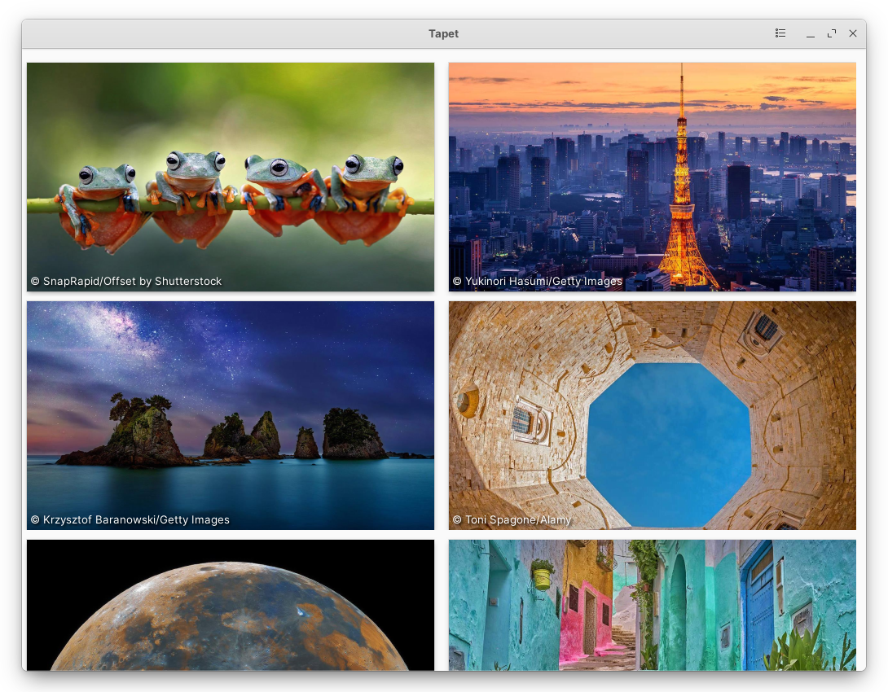
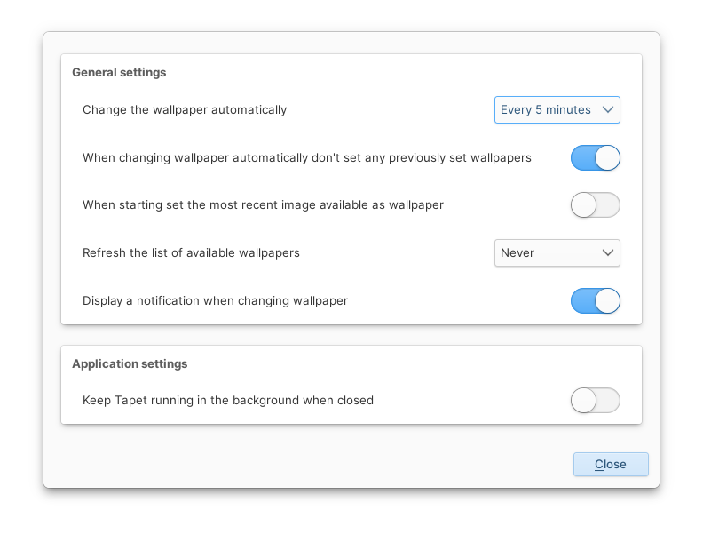

## Tapet

### Download and apply wallpapers from popular online sources

View wallpapers from popular online sources (only Bing Wallpaper of the Day is currently supported), save them and set them as your desktop wallpaper.

#### Features:
  * Automatically update a list of available wallpapers, on a schedule.
  * Automatically apply, on a schedule, the latest wallpaper available from any source.
  * Automatically apply the latest wallpaper when starting up the application.
  * Save any image to a location of your choosing.
  * Run in the background so that the app stays invisible, while continuing to do any of the scheduled tasks.
  
#### Planned features:
  * Implement at least 2 more image providers: Local and Unsplash
  
#### Screenshots:



#### Building
The application depends on the following:
`meson, valac, gtk+-3.0, granite, libhandy-1, libsoup-2.4, json-glib-1.0, libdconf`. In addition, the build a Flatpak package the `io.elementary.Sdk` must be installed or installable.

After obtaining the dependencies the application can be build as a native application or a Flatpak package.

Build for the host machine: 
```
meson build -Dbuildtype=release -Dprefix=/usr 
cd build && ninja
sudo ninja install
```

Build as a Flatpak and install:
```
mkdir build && cd build
flatpak-builder flatpak ../flatpak/com.github.kicsyromy.tapet.yml --user --install --force-clean
```
